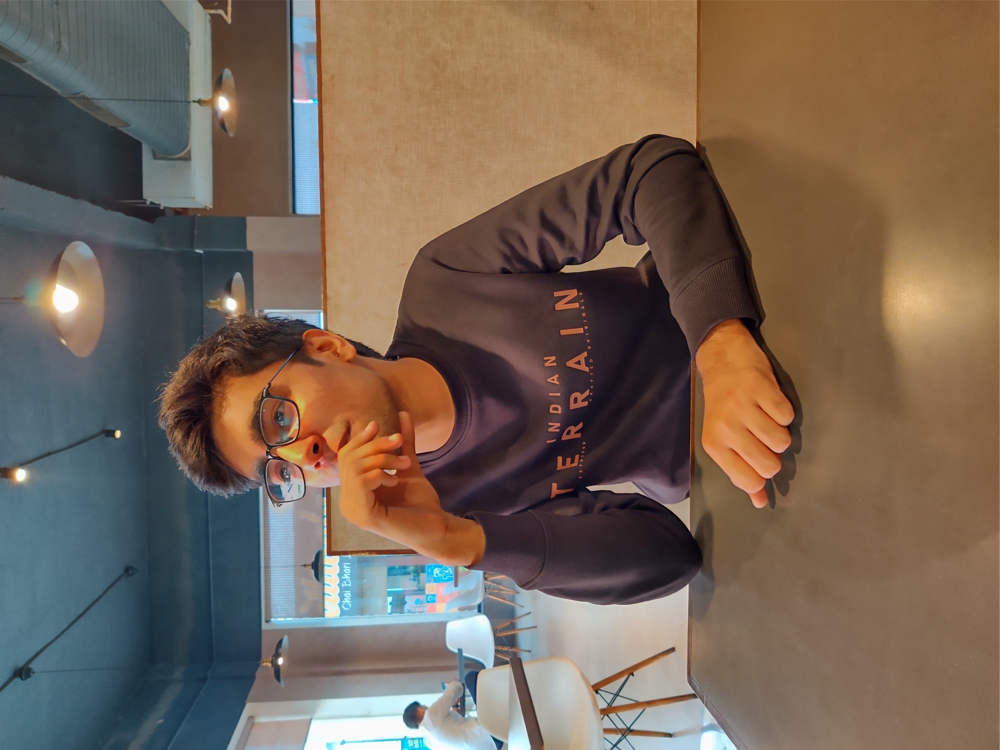

# Prototype Source Code for Reboot The Earth - India
### Hackathon     : ``` Reboot The Earth (India) ```
### Organisation  : ``` United Nations Technology Innovation Labs (UNTIL) ```
### Challenge     : ```Women + Climate```
### Project Title : ```Women + Change : A Platform for Women to Earn, Learn and Change```
### Team Name     : ```PRAGYAN```
### Team Members

  
<br>
[Ansh Walia](https://www.github.com/anshwalia)&nbsp;&nbsp;&nbsp;&nbsp;&nbsp;&nbsp;&nbsp;&nbsp;&nbsp;&nbsp;&nbsp;&nbsp;&nbsp;&nbsp;&nbsp;&nbsp;
[Satvik Chachra](https://www.github.com/satvikchachra)&nbsp;&nbsp;&nbsp;&nbsp;&nbsp;&nbsp;&nbsp;&nbsp;&nbsp;&nbsp;&nbsp;&nbsp;&nbsp;&nbsp;&nbsp;&nbsp;
[Saransh Dawra](https://www.github.com/saranshdawra)

